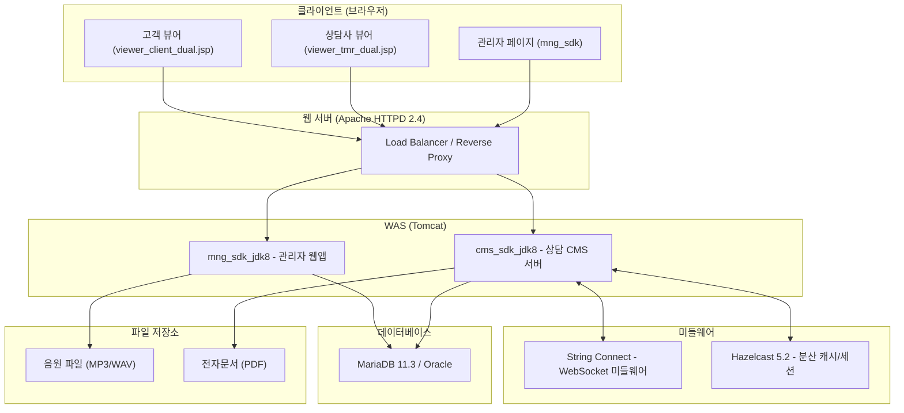

# TMM (TeleMarketing Mirroring) 프로젝트 포트폴리오

## 1. 프로젝트 개요

| 항목 | 내용 |
|---|---|
| **프로젝트명** | TMM (TeleMarketing Mirroring) 시스템 |
| **프로젝트 유형** | 보험업 전화 상담 지원 웹 시스템 (전자문서 미러링 + 음원 관리) |
| **아키텍처** | 멀티 모듈 WAR 기반 웹 애플리케이션 |
| **Java 버전** | JDK 8 |
| **빌드 도구** | Maven |

### 프로젝트 설명

보험 TM(텔레마케팅) 업무에서 **상담사와 고객 간의 전자문서를 실시간 미러링(공유)**하고, **상담 음원을 체계적으로 관리**하기 위한 엔터프라이즈 웹 시스템입니다. 상담사가 고객에게 보험 가입 서류를 화면으로 공유(미러링)하면서 전화 상담을 진행하고, 상담 녹취 음원을 버전별로 관리할 수 있습니다.

---

## 2. 시스템 아키텍처

### 서브 프로젝트 구성

| 모듈 | 역할 | 패키징 |
|---|---|---|
| **mng_sdk_jdk8** | 관리자용 웹 애플리케이션 (음원·서식·카테고리 CRUD, 엑셀 일괄등록) | WAR |
| **cms_sdk_jdk8** | 상담 CMS 서버 (미러링 채널 관리, WebSocket 통신, Hazelcast 세션) | WAR |
| **string_connect** | 상담사-고객 간 실시간 미러링을 중계하는 WebSocket 미들웨어 | Standalone |

---

## 3. 사용 기술 스택

### Backend

| 분류 | 기술 | 버전 |
|---|---|---|
| **Framework** | Spring Framework | 5.3.39 |
| **Security** | Spring Security | 5.8.13 |
| **ORM** | MyBatis | 3.5.19 |
| **MyBatis-Spring** | MyBatis-Spring | 2.0.7 |
| **WebSocket** | Spring WebSocket + STOMP | 5.3.39 |
| **분산 캐시/세션** | Hazelcast (+ Spring Session Hazelcast) | 5.2.3 |
| **인증** | JWT (jjwt) | 0.11.2 |
| **로깅** | Log4j2 + SLF4J | 2.24.3 / 2.0.17 |
| **직렬화** | Jackson / Gson | 2.19.2 / 2.11.0 |
| **파일 처리** | Apache POI (Excel), Commons FileUpload, Zip4j | 4.1.2 / 1.6.0 / 2.11.5 |
| **오디오 변환** | jump3r (WAV→MP3 인코딩) | 1.0.5 |
| **PDF 처리** | PDFBox | 2.0.29 |
| **암호화** | BouncyCastle, Unidocs Cipher | 1.80 |
| **코드 간소화** | Lombok | 1.18.32 |

### Frontend

| 분류 | 기술 |
|---|---|
| **뷰 템플릿** | JSP + JSTL 1.2 |
| **실시간 통신** | SockJS + STOMP (WebSocket) |
| **오디오 재생** | Howler.js (Web Audio API) |
| **기타** | jQuery, JavaScript |

### 인프라

| 분류 | 기술 | 버전 |
|---|---|---|
| **WAS** | Apache Tomcat | - |
| **웹 서버** | Apache HTTPD (L4 로드밸런서 역할) | 2.4.64 |
| **DBMS** | MariaDB / Oracle | 11.3 / 19c |
| **Java** | JDK | 8 |
| **배포 구성** | 클러스터 2노드 (cluster1, cluster2) | - |

---

## 4. 구현 기능 상세

### 4.1. 🎵 음원 관리 (Audio Management)

> 보험 TM 상담에 사용되는 음원 파일을 체계적으로 등록·버전 관리하는 기능

| 기능 | 설명 |
|---|---|
| **음원 CRUD** | 음원 목록 조회, 등록, 수정, 삭제 (사용여부 토글) |
| **버전 관리** | 음원별 다중 버전 관리 (적용 시작일/종료일 기반), 버전 조회/수정/개정 |
| **음원 재생** | Howler.js 기반 브라우저 내 스트리밍 재생, 배속 조절 (0.5x ~ 2.0x) |
| **파일 처리** | WAV→MP3 자동 변환 (jump3r), 파일 다운로드 |
| **엑셀 일괄등록** | Apache POI 기반 Excel 파일 파싱, 비동기 배치 처리, 중복 감지/업데이트 모드 지원 |
| **엑셀 다운로드** | 음원 목록 CSV/Excel 내보내기, 버전 ID 제로패딩 포맷팅 |

**주요 파일:**
- [AudioController.java](file:///C:/DEV_TMM_JDK8/workspace/mng_sdk_jdk8/src/main/java/com/unidocs/sdk/mng/audio/web/AudioController.java) (1,305 lines)
- [AudioService.java](file:///C:/DEV_TMM_JDK8/workspace/mng_sdk_jdk8/src/main/java/com/unidocs/sdk/mng/audio/service/AudioService.java) (501 lines)
- [AudioExcelBatchService.java](file:///C:/DEV_TMM_JDK8/workspace/mng_sdk_jdk8/src/main/java/com/unidocs/sdk/mng/audio/batch/AudioExcelBatchService.java) (336 lines)

---

### 4.2. 🏷️ 음원 유형/세부 유형 관리

> 음원을 분류하기 위한 카테고리 계층 구조 관리

| 기능 | 설명 |
|---|---|
| **음원 유형 CRUD** | 음원 유형 코드/이름 관리, 중복 체크 |
| **세부 유형 CRUD** | 부모 유형에 종속된 세부 유형 코드/이름 관리 |
| **계층 구조** | 유형 → 세부 유형 1:N 관계, 유형 선택 시 세부 유형 동적 로딩 (AJAX) |

**DB 테이블:** `TLTMR232` (음원 유형), `TLTMR233` (음원 세부 유형)

---

### 4.3. 📺 실시간 미러링 (상담사-고객 화면 공유)

> 보험 가입 프로세스에서 상담사와 고객이 동일한 전자문서를 실시간으로 함께 보는 기능

| 기능 | 설명 |
|---|---|
| **WebSocket 통신** | Spring WebSocket + STOMP 프로토콜 기반 양방향 실시간 통신 |
| **미러링 채널** | 상담사-고객 1:1 채널 생성/관리, 채널 상태 추적 |
| **세션 관리** | Hazelcast `connected-users-map`으로 접속자 실시간 추적 |
| **연결 종료 처리** | `SessionDisconnectEvent` 기반 2단계 프로세스 (고객 이탈 → TTL 만료 후 삭제) |
| **상담사 뷰어** | 전자문서(PDF) 표시, 고객 화면 동기화, 음원 재생, 배속 공유 |
| **고객 뷰어** | 상담사와 동일한 전자문서 미러 뷰, 배속 수신 |
| **Dual 뷰어** | 상담사/고객 동시 지원 듀얼 뷰어 ([viewer_tmr_dual.jsp](file:///C:/DEV_TMM_JDK8/workspace/cms_sdk_jdk8/src/main/webapp/WEB-INF/jsp/sdk/view_dual/viewer_tmr_dual.jsp), [viewer_client_dual.jsp](file:///C:/DEV_TMM_JDK8/workspace/cms_sdk_jdk8/src/main/webapp/WEB-INF/jsp/sdk/view_dual/viewer_client_dual.jsp)) |

**주요 파일:**
- [CmsChannelService.java](file:///C:/DEV_TMM_JDK8/workspace/cms_sdk_jdk8/src/main/java/com/unidocs/sdk/cms/tmm/service/CmsChannelService.java) (8,474 lines)
- [WebSocketActionManager.java](file:///C:/DEV_TMM_JDK8/workspace/cms_sdk_jdk8/src/main/java/com/unidocs/sdk/tms/websocket/WebSocketActionManager.java)
- [HazelcastConfig.java](file:///C:/DEV_TMM_JDK8/workspace/cms_sdk_jdk8/src/main/java/com/unidocs/sdk/tms/config/HazelcastConfig.java)

---

### 4.4. 📋 서식/전자문서 관리

> 보험 가입 서류(전자문서 서식)의 등록·버전 관리

| 기능 | 설명 |
|---|---|
| **서식 CRUD** | 서식 목록 조회, 등록, 수정, 개정 |
| **버전 관리** | 서식 버전별 관리 (버전 목록, 버전 상세 보기, 버전 수정) |
| **카테고리 분류** | 서식을 카테고리별로 분류/관리 |

**JSP 페이지:** `form/list.jsp`, `form/register.jsp`, `form/modify.jsp`, `form/versionList.jsp`, `form/versionView.jsp`

---

### 4.5. 📑 리플릿 관리

> 보험 상품 리플릿(안내 책자)의 등록·버전 관리

| 기능 | 설명 |
|---|---|
| **리플릿 CRUD** | 리플릿 목록 조회, 등록, 수정, 개정 |
| **버전 관리** | 리플릿 버전별 관리 |

---

### 4.6. 📊 상담 이력/모니터링

> 상담 프로세스 전반을 관리하고 모니터링하는 기능

| 기능 | 설명 |
|---|---|
| **상담 목록** | 상담 이력 목록 조회, 엑셀 다운로드 ([cnslList.jsp](file:///C:/DEV_TMM_JDK8/workspace/mng_sdk_jdk8/src/main/webapp/WEB-INF/jsp/tmm/cnslList.jsp)) |
| **상담 팝업** | 상담 상세 정보 팝업 (단일/듀얼) |
| **상담 리플레이** | 완료된 상담을 다시 재생 ([replay_main.jsp](file:///C:/DEV_TMM_JDK8/workspace/mng_sdk_jdk8/src/main/webapp/WEB-INF/jsp/replay/replay_main.jsp), [dual_replay_main.jsp](file:///C:/DEV_TMM_JDK8/workspace/mng_sdk_jdk8/src/main/webapp/WEB-INF/jsp/replay/dual_replay_main.jsp)) |
| **LMS 발송/인증** | 피보험자 LMS 발송 및 인증 프로세스 |
| **완전판매 모니터링** | 보험 완전판매 프로세스 모니터링 및 완료 처리 |
| **단계 저장** | 상담 단계별 데이터 저장 ([saveStep](file:///C:/DEV_TMM_JDK8/workspace/cms_sdk_jdk8/src/main/java/com/unidocs/sdk/cms/tmm/service/CmsChannelService.java#4237-5475)) |

---

### 4.7. 👤 사용자/로그인 관리

| 기능 | 설명 |
|---|---|
| **인증** | Spring Security + JWT 기반 인증 |
| **세션 관리** | Spring Session + Hazelcast 분산 세션 |
| **사용자 관리** | 관리자 사용자 CRUD |

---

### 4.8. 🛡️ 비기능 요구사항

| 항목 | 구현 |
|---|---|
| **HA (고가용성)** | 2노드 클러스터 배포 (cluster1, cluster2), Hazelcast 분산 캐시로 세션 공유 |
| **멀티 DB 지원** | MariaDB / Oracle 동시 지원 (프로파일 기반 전환) |
| **환경 분리** | Maven 프로파일 (local, dev, linux, stg, release1, release2) |
| **보안** | HTTPS, JWT, Spring Security, BouncyCastle 암호화 |
| **로깅** | Log4j2 + SLF4J 통합 로깅 |

---

## 5. 데이터베이스 설계

총 **19개 MySQL 테이블** + Oracle 호환 DDL 관리

| 테이블 | 설명 |
|---|---|
| `TLTMR101` ~ `TLTMR106` | 상담 관련 마스터/이력 테이블 |
| `TLTMR110`, `TLTMR111` | 상담 부가 데이터 |
| `TLTMR201` ~ `TLTMR205`, `TLTMR210`, `TLTMR211` | 서식/리플릿/버전 관련 테이블 |
| `TLTMR230` | 음원 마스터 |
| `TLTMR231` | 음원 버전 |
| `TLTMR232` | 음원 유형 |
| `TLTMR233` | 음원 세부 유형 |

---

## 6. 프로젝트 규모

| 지표 | 수치 |
|---|---|
| **Java 소스 파일** | 50+ 파일 |
| **JSP 페이지** | 60+ 페이지 |
| **MyBatis XML 매퍼** | 10+ 파일 |
| **DB 테이블** | 19개 (MySQL) + Oracle 호환 |
| **핵심 서비스 코드** | CmsChannelService 8,474 lines, AudioController 1,305 lines 등 |
| **배포 프로파일** | 6개 (local, dev, linux, stg, release1, release2) |

---

## 7. 핵심 기술적 성과

1. **실시간 미러링 아키텍처 설계/구현** — Spring WebSocket + STOMP + Hazelcast를 결합하여 상담사-고객 간 전자문서 실시간 동기화
2. **Hazelcast 기반 분산 세션/캐시 관리** — 2노드 클러스터 환경에서 세션 공유 및 접속자 실시간 추적
3. **음원 체계적 관리 시스템 구축** — 버전 관리, WAV→MP3 변환, 엑셀 일괄등록(비동기 배치), 스트리밍 재생
4. **멀티 DB 환경 대응** — Oracle/MariaDB 동시 지원 DDL 및 MyBatis 매퍼 설계
5. **엔터프라이즈 배포 구조** — Apache HTTPD L4 → Tomcat 클러스터 2노드, 6단계 프로파일 기반 빌드/배포
